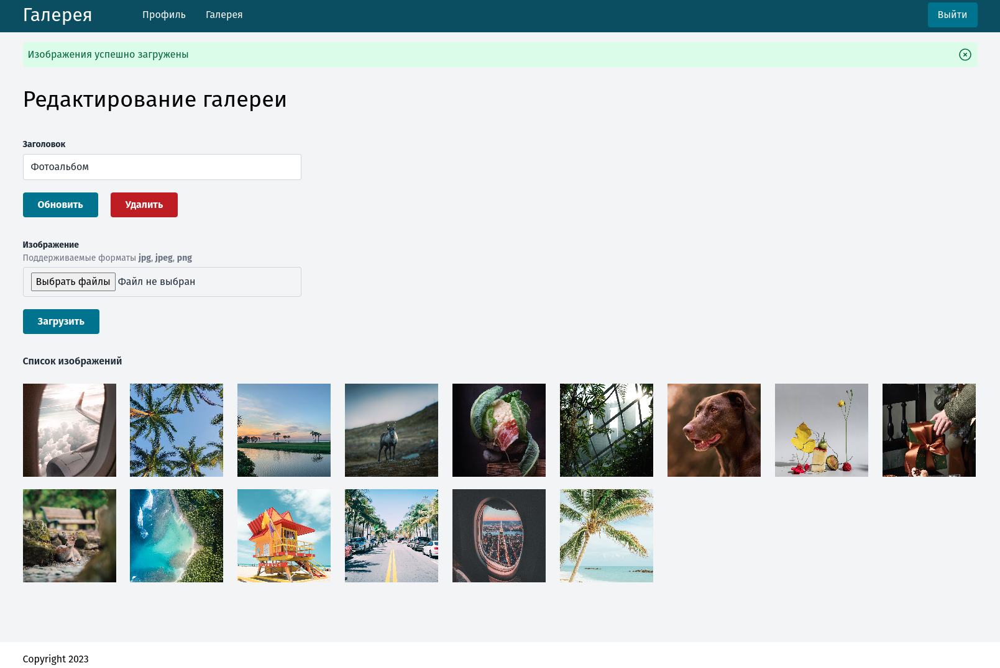

# Галерея изображений

Данный проект был реализован на основе [прошлой работы](https://github.com/eliofery/golang-framework?tab=readme-ov-file#html-%D0%B2%D0%B5%D0%B1-%D1%81%D0%B5%D1%80%D0%B2%D0%B5%D1%80).

Позволяет каждому зарегистрированному пользователю создавать для себя отдельные галереи и загружать в них изображения.



## Запуск проекта

```bash
docker compose up -d

modd
```
